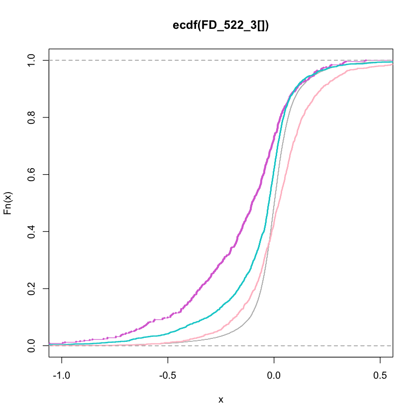
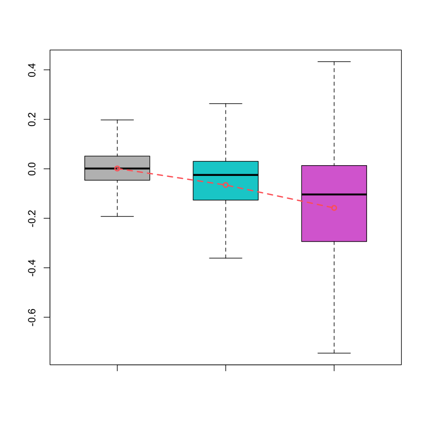
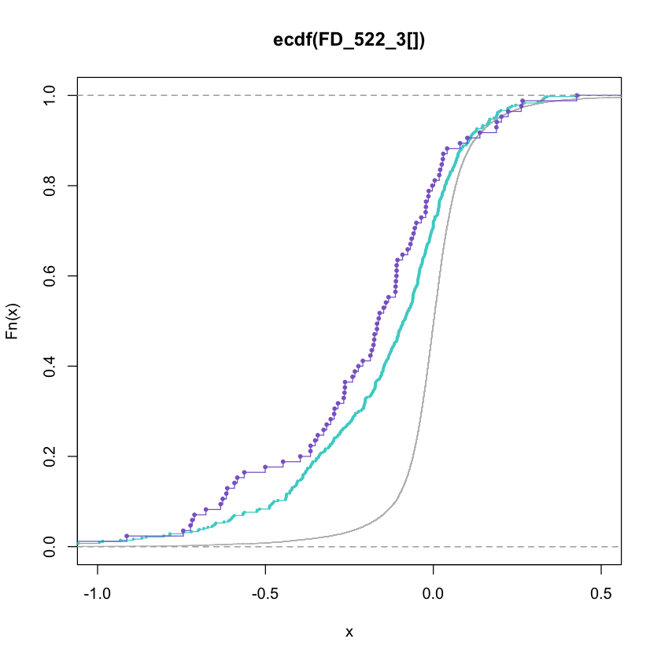
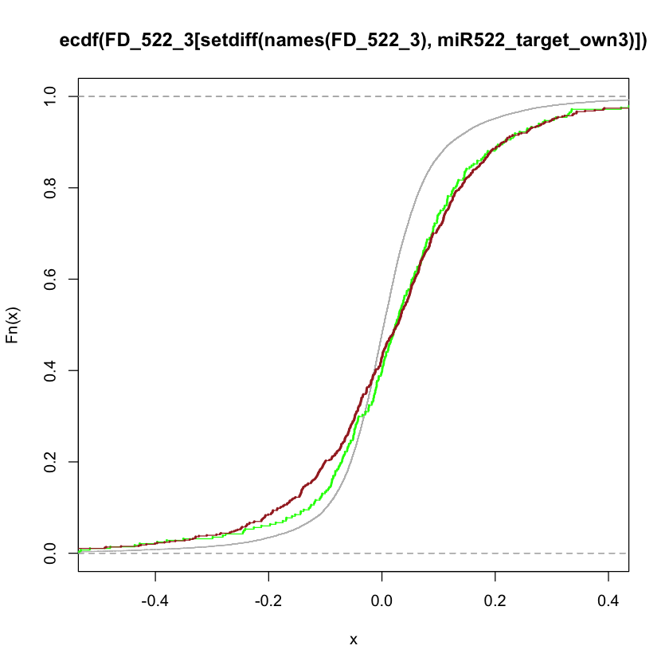

```R

library(gdata)
read.xls("/Users/James/Desktop/交大其他课题/yale_project/mirna/New_data/miR-552/1-s2.0-S221112471400607X-mmc3.xlsx",header=T)->MRE
MRE [which(MRE[,"Location"]%in%c("3'UTR","CDS/3'UTR")),]-> MRE_tmep1

MRE_tmep1[,c("Chr","Start","End","Associated.gene.name")]->MRE2_tmp

MRE_tmep1[,c("Fold.enrichment","Associated.gene.name","Sequence")]->MRE2


```

    gdata: read.xls support for 'XLS' (Excel 97-2004) files ENABLED.
    
    
    
    gdata: read.xls support for 'XLSX' (Excel 2007+) files ENABLED.
    
    
    Attaching package: ‘gdata’
    
    
    The following object is masked from ‘package:stats’:
    
        nobs
    
    
    The following object is masked from ‘package:utils’:
    
        object.size
    
    
    The following object is masked from ‘package:base’:
    
        startsWith
    
    


```R

#######load predict targets

read.table("/Users/James/Desktop/交大其他课题/yale_project/mirna/New_data/miR-552/nextBatch/hsa-miR522-3p-Seed3pUTR.txt",header=F,sep="\t")->miR522_target_own

unique(as.vector(miR522_target_own [which(miR522_target_own[,"V7"]%in%c("7mer-A1","7mer-m8","8mer")),1]))-> miR522_target_own2
#unique(as.vector(miR522_target_own[,1]))-> miR522_target_own_have6mer


#####ID format transformat
library(biomaRt)
#mart = useMart(host="useast.ensembl.org",
mart = useMart(host="http://aug2020.archive.ensembl.org",

biomart="ENSEMBL_MART_ENSEMBL",
dataset="hsapiens_gene_ensembl")


```


```R

miR522_target_own3 = as.vector(as.matrix(getBM(attributes = c( 'hgnc_symbol'),  filters = "refseq_mrna" ,values = miR522_target_own2 , mart = mart,useCache = FALSE)))


#miR522_target_own3_6mer = as.vector(as.matrix(getBM(attributes = c( 'hgnc_symbol'),  filters = "refseq_mrna" ,values = miR522_target_own_have6mer , mart = mart,useCache = FALSE)))

unique(as.vector(MRE2[,"Associated.gene.name"]))->MRE_genes
intersect(miR522_target_own3,MRE_genes)->ST_MRE # strong targets with MRE
unique(setdiff(miR522_target_own3,MRE2[,"Associated.gene.name"]))->ST_uniq #strong targets without MRE


######miR-522 expression
read.table("/Users/James/Desktop/交大其他课题/yale_project/mirna/New_data/miR-552/miR-522_Overexpression_in_MDA-MB-468.txt",header=T,row.names=1,sep="\t")->exp
rowMeans(log(exp[,c(2,4,6)]),2)- rowMeans(log(exp[,c(1,3,5)]),2)->FD_522
read.delim("/Users/James/Desktop/交大其他课题/yale_project/mirna/New_data/miR-552/GPL10558-50081.txt",sep="\t",header=T,row.names=1)->platform_HT
platform_HT[,c("Symbol","Accession")]-> platform_HT2
merge(FD_522, platform_HT2,by.x=0,by.y=0)-> FD_522_2


FD_522_3=c()
for(n in unique(FD_522_2[,"Symbol"]))
{
    FD_522_3=c(FD_522_3,mean(FD_522_2 [which(FD_522_2[,"Symbol"]%in%n),"x"]))
    
    
}
names(FD_522_3)<-unique(FD_522_2[,"Symbol"])


plot(ecdf(FD_522_3[]),col="grey",cex=0.5 ,xlim=c(-1,0.5))
lines(ecdf(FD_522_3[ST_MRE]),col="#DA70D6",cex=0.3)

unique(setdiff(MRE2[,"Associated.gene.name"],miR522_target_own3))->MRE_uniq #strong targets without MRE
lines(ecdf(FD_522_3[ST_uniq]),col="#00CED1",cex=1,lwd=2)
lines(ecdf(FD_522_3[MRE_uniq]),col="pink",cex=1,lwd=2)

########FIgure 4c
means<-c(mean(FD_522_3),mean(FD_522_3[ST_uniq],na.rm=T),mean(FD_522_3[ST_MRE],na.rm=T))
boxplot(FD_522_3,FD_522_3[ST_uniq],FD_522_3[ST_MRE],outline=F,col=c("grey","#00CED1","#DA70D6"),boxwex=0.6)
lines(1:3, means, col = "#FF6766",type="o",lwd=2,lty=2)
(means[2]-means[1])/(means[3]-means[1])
(means[3]-means[1])/(means[3]-means[1])

ks.test(FD_522_3[ST_MRE],FD_522_3[ST_uniq])
ks.test(FD_522_3,FD_522_3[ST_uniq])

```

    
    Batch submitting query [=====>-------------------------]  20% eta:  6s
    
    Batch submitting query [===========>-------------------]  40% eta:  4s
    
    Batch submitting query [==================>------------]  60% eta:  2s
    
    Batch submitting query [========================>------]  80% eta:  1s
                                                                          
    


    

    


0.418592461856096


1


    
    	Two-sample Kolmogorov-Smirnov test
    
    data:  FD_522_3[ST_MRE] and FD_522_3[ST_uniq]
    D = 0.21765, p-value < 2.2e-16
    alternative hypothesis: two-sided


    Warning message in ks.test(FD_522_3, FD_522_3[ST_uniq]):
    “p-value will be approximate in the presence of ties”


    
    	Two-sample Kolmogorov-Smirnov test
    
    data:  FD_522_3 and FD_522_3[ST_uniq]
    D = 0.18082, p-value < 2.2e-16
    alternative hypothesis: two-sided


    

    


```R

################### strong targets with MRE and MRE sites figure 4f

MRE2_tmp[which(MRE2_tmp[,4]%in%miR522_target_own3),]->ST_MRE_list
#write.table(ST_MRE_list,"ST_MRE_list.txt",quote=F,sep="\t",col.names=F,row.names=F)

read.table("/Users/James/Desktop/交大其他课题/yale_project/mirna/New_data/miR-552/MRE_files/genes_seedlessMRE.txt")->gene_seedless_MRE  ### this file is from MRE files minus known strong sties

as.vector(as.matrix(gene_seedless_MRE))->gene_seedless_MRE

intersect(gene_seedless_MRE,ST_MRE)->ST_seedless_MRE

setdiff(ST_MRE,ST_seedless_MRE)->ST_Noseedless_MRE
ks.test(FD_522_3[ST_seedless_MRE],FD_522_3[ST_Noseedless_MRE],alternative="less")

unique(as.vector(t(read.table("/Users/James/Desktop/交大其他课题/yale_project/mirna/New_data/miR-552/mapping_overlap/strong_MRE/seed_MRE_covered_genes.txt",header=F))))->gene_cover_seed

intersect(gene_cover_seed, ST_MRE)->gene_cover_seed
plot(ecdf(FD_522_3[]),col="grey",cex=0.5 ,xlim=c(-1,0.5),verticals=T)
lines(ecdf(FD_522_3[ST_seedless_MRE]),col="#48D1CC",cex=0.3,verticals=T)
lines(ecdf(FD_522_3[ST_Noseedless_MRE]),col="#8968CD",cex=0.5,verticals=T)
#lines(ecdf(FD_522_3[gene_cover_seed]),col="red",cex=0.5,verticals=T)
#lines(ecdf(FD_522_3[intersect(gene_cover_seed,ST_seedless_MRE )]),col="blue",cex=0.5,verticals=T)
#lines(ecdf(FD_522_3[setdiff(gene_cover_seed,ST_seedless_MRE )]),col="black",cex=0.5,verticals=T)


```


    
    	Two-sample Kolmogorov-Smirnov test
    
    data:  FD_522_3[ST_seedless_MRE] and FD_522_3[ST_Noseedless_MRE]
    D^- = 0.17101, p-value = 0.01601
    alternative hypothesis: the CDF of x lies below that of y


    

    


```R


###################### figure 4e
read.table("/Users/James/Desktop/交大其他课题/yale_project/mirna/New_data/miR-552/nextBatch/hsa-miR522-3p-Seedless3pUTR.txt",header=F,sep="\t")->WS
WS[which(WS[,"V7"]=="other"),1]->WS_genes
table(as.vector(WS_genes))->WS_genes_counts
WS_genes_counts_list = as.matrix(getBM(attributes = c( 'hgnc_symbol','refseq_mrna'),  filters = "refseq_mrna" ,values = names(WS_genes_counts) , mart = mart, useCache=F))
merge(as.matrix(WS_genes_counts),WS_genes_counts_list,by.x=0,by.y=2,all.y=T)->merge_WS
merge_WS[order(merge_WS[,2],decreasing=T),]->merge_WS2
merge_WS2[which(!duplicated(merge_WS2[,3])),]->merge_WS3
quantile(merge_WS3[,2],c(1/3,2/3))->quan_seedless
as.vector(merge_WS3[which(merge_WS3[,2]<=quan_seedless[1]),3])->gene_1seedless
as.vector(merge_WS3[which(merge_WS3[,2]>quan_seedless[2]),3])->gene_3seedless
setdiff(merge_WS3[,3],c(gene_1seedless,gene_3seedless))->gene_2seedless
length(intersect(gene_seedless_MRE,gene_1seedless))/length(gene_1seedless)->p1
length(intersect(gene_seedless_MRE,gene_2seedless))/length(gene_2seedless)->p2
length(intersect(gene_seedless_MRE,gene_3seedless))/length(gene_3seedless)->p3
barplot(c(p1,p2,p3),col=c("#BE77FF","#40E0D0","#FFC300"),width=10)


```

    
    Batch submitting query [>------------------------------]   3% eta: 35s
    
    Batch submitting query [=>-----------------------------]   7% eta: 29s
    
    Batch submitting query [==>----------------------------]  10% eta: 27s
    
    Batch submitting query [===>---------------------------]  13% eta: 25s
    
    Batch submitting query [====>--------------------------]  17% eta: 24s
    
    Batch submitting query [=====>-------------------------]  20% eta: 22s
    
    Batch submitting query [======>------------------------]  23% eta: 21s
    
    Batch submitting query [=======>-----------------------]  27% eta: 20s
    
    Batch submitting query [========>----------------------]  30% eta: 18s
    
    Batch submitting query [=========>---------------------]  33% eta: 17s
    
    Batch submitting query [==========>--------------------]  37% eta: 16s
    
    Batch submitting query [===========>-------------------]  40% eta: 15s
    
    Batch submitting query [============>------------------]  43% eta: 14s
    
    Batch submitting query [=============>-----------------]  47% eta: 13s
    
    Batch submitting query [===============>---------------]  50% eta: 12s
    
    Batch submitting query [================>--------------]  53% eta: 11s
    
    Batch submitting query [=================>-------------]  57% eta: 10s
    
    Batch submitting query [==================>------------]  60% eta:  9s
    
    Batch submitting query [===================>-----------]  63% eta:  8s
    
    Batch submitting query [====================>----------]  67% eta:  8s
    
    Batch submitting query [=====================>---------]  70% eta:  7s
    
    Batch submitting query [======================>--------]  73% eta:  6s
    
    Batch submitting query [=======================>-------]  77% eta:  5s
    
    Batch submitting query [========================>------]  80% eta:  4s
    
    Batch submitting query [=========================>-----]  83% eta:  3s
    
    Batch submitting query [==========================>----]  87% eta:  3s
    
    Batch submitting query [===========================>---]  90% eta:  2s
    
    Batch submitting query [============================>--]  93% eta:  1s
    
    Batch submitting query [=============================>-]  97% eta:  1s
                                                                          
    


    

    


```R
######### continie code for MRE_seedless_Nonetargets
#define ST_pool
setdiff(gene_seedless_MRE, miR522_target_own3) ->non_ST_seedless

unique(setdiff(MRE2[,"Associated.gene.name"],miR522_target_own3))->MRE_uniq #strong targets without MRE

MRE2_tmp_new<-data.frame(MRE2_tmp,paste_name = paste(MRE2_tmp[,1],MRE2_tmp[,2],MRE2_tmp[,3],sep="_"))
read.table("/Users/James/Desktop/交大其他课题/yale_project/mirna/New_data/miR-552/2022_MRE_only_seedless.txt",header=F,sep="\t")->new_seedless
new_seedless2<-paste(new_seedless[,1],new_seedless[,2],new_seedless[,3],sep="_")

subset(MRE2_tmp_new, paste_name %in% new_seedless2 ) ->MRE2_tmp_new2

MRE_seedless_uniqgene<-as.vector(unique(MRE2_tmp_new2[,4]))

#setdiff(MRE_seedless_uniqgene,miR522_target_own3_6mer)->MRE_seedless_uniqgene_nonST
setdiff(MRE_seedless_uniqgene,miR522_target_own3)->MRE_seedless_uniqgene_nonST
intersect(MRE_seedless_uniqgene,miR522_target_own3)->MRE_seedless_uniqgene_ST

read.table("/Users/James/Desktop/交大其他课题/yale_project/mirna/New_data/miR-552/2022_overlap_MRE_seedless.bed",sep="\t")->Overlap_seedless
Overlap_seedless2<-paste(Overlap_seedless[,1],Overlap_seedless[,2],Overlap_seedless[,3],sep="_")

subset(MRE2_tmp_new, paste_name %in% Overlap_seedless2 ) ->MRE2_overlap_seedless
MRE_seedless_overlap<-as.vector(unique(MRE2_overlap_seedless[,4]))
setdiff(MRE_seedless_overlap,miR522_target_own3 ) ->MRE_seedless_overlap_nonST

```


```R

###################### figure 4e
merge(as.matrix(WS_genes_counts),WS_genes_counts_list,by.x=0,by.y=2,all.y=T)->merge_WS
merge_WS[order(merge_WS[,2],decreasing=T),]->merge_WS2
merge_WS2[which(!duplicated(merge_WS2[,3])),]->merge_WS3

merge_WS3_predict_seedless_unique<-subset(merge_WS3, !hgnc_symbol %in% c(miR522_target_own3,MRE_seedless_uniqgene_nonST,MRE_seedless_overlap_nonST ))
quantile(merge_WS3_predict_seedless_unique[,2],c(1/2,1/2))->quan_seedless
as.vector(merge_WS3_predict_seedless_unique[which(merge_WS3_predict_seedless_unique[,2]<=3),3])->gene_seedless_unique_fewer
as.vector(merge_WS3_predict_seedless_unique[which(merge_WS3_predict_seedless_unique[,2]>25),3])->gene_seedless_unique_more

plot(ecdf(FD_522_3[setdiff(names(FD_522_3),miR522_target_own3)]),col="grey",cex=0.5 ,xlim=c(-0.5,0.4),verticals=T)
#lines(ecdf(FD_522_3[]),col="black",cex=0.5 ,xlim=c(-0.5,0.4),verticals=T)

#lines(ecdf(FD_522_3[gene_seedless_unique_fewer]),col="blue",cex=0.3,verticals=T) #FADD0A
#lines(ecdf(FD_522_3[gene_seedless_unique_more]),col="red",cex=0.5,verticals=T)
#lines(ecdf(FD_522_3[as.vector(merge_WS3_predict_seedless_unique[,3])]),col="red",cex=0.5,verticals=T)

lines(ecdf(FD_522_3[setdiff(MRE_seedless_uniqgene_nonST,MRE_seedless_overlap_nonST )]),col="green",cex=0.2,verticals=T)
lines(ecdf(FD_522_3[setdiff(MRE_seedless_overlap_nonST,MRE_seedless_uniqgene_nonST) ]),col="brown",cex=0.2,verticals=T)

ks.test(FD_522_3[setdiff(MRE_seedless_overlap_nonST,MRE_seedless_uniqgene_nonST) ], FD_522_3[setdiff(names(FD_522_3),miR522_target_own3)],alternative="less")
ks.test(FD_522_3[setdiff(MRE_seedless_uniqgene_nonST,MRE_seedless_overlap_nonST) ], FD_522_3[setdiff(names(FD_522_3),miR522_target_own3)],alternative="less")


```

    Warning message in ks.test(FD_522_3[setdiff(MRE_seedless_overlap_nonST, MRE_seedless_uniqgene_nonST)], :
    “p-value will be approximate in the presence of ties”


    
    	Two-sample Kolmogorov-Smirnov test
    
    data:  FD_522_3[setdiff(MRE_seedless_overlap_nonST, MRE_seedless_uniqgene_nonST)] and FD_522_3[setdiff(names(FD_522_3), miR522_target_own3)]
    D^- = 0.1751, p-value < 2.2e-16
    alternative hypothesis: the CDF of x lies below that of y


    Warning message in ks.test(FD_522_3[setdiff(MRE_seedless_uniqgene_nonST, MRE_seedless_overlap_nonST)], :
    “p-value will be approximate in the presence of ties”


    
    	Two-sample Kolmogorov-Smirnov test
    
    data:  FD_522_3[setdiff(MRE_seedless_uniqgene_nonST, MRE_seedless_overlap_nonST)] and FD_522_3[setdiff(names(FD_522_3), miR522_target_own3)]
    D^- = 0.17083, p-value = 7.431e-08
    alternative hypothesis: the CDF of x lies below that of y


    

    


```R

```


```R

```


```R

```


```R

```


```R

```


```R

```


```R

```


```R

```
